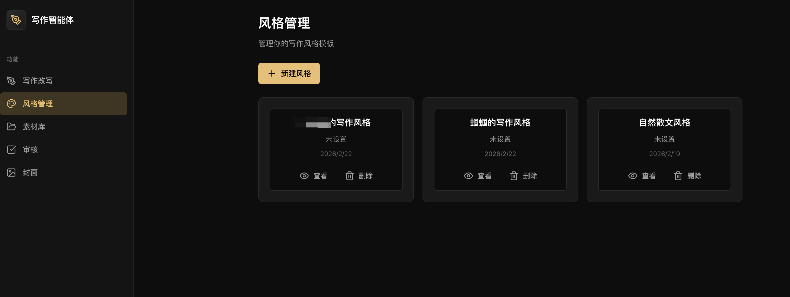
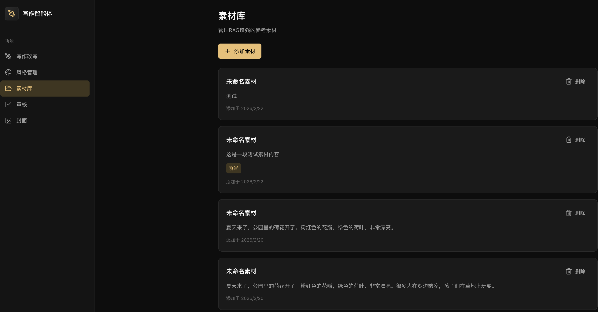
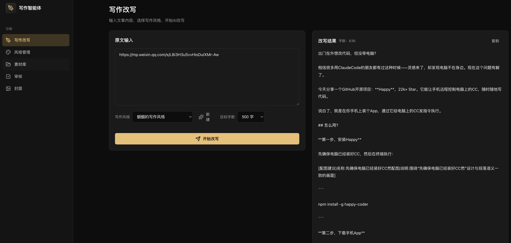
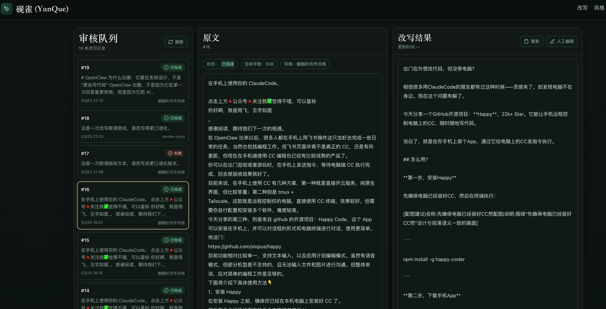
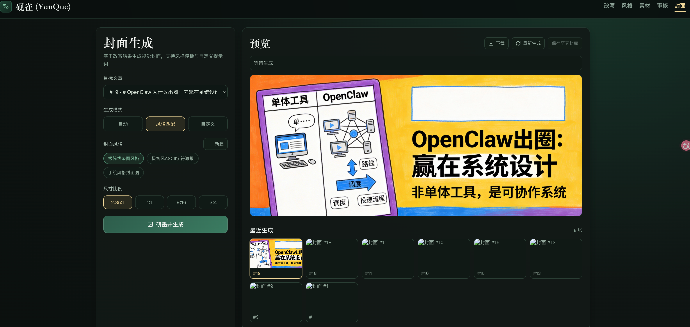

# Write Agent

AI writing assistant built with FastAPI, LangChain, LangGraph, RAG, and OpenAI-compatible APIs for style extraction, rewriting, review, and cover generation.

[中文文档](./README.zh-CN.md)

## Table of Contents

- [Features](#features)
- [Screenshots](#screenshots)
- [Tech Stack and Architecture](#tech-stack-and-architecture)
- [Prerequisites](#prerequisites)
- [Quick Start](#quick-start)
- [Environment Variables](#environment-variables)
- [Run and Verify](#run-and-verify)
- [Usage Guide](#usage-guide)
- [Project Structure](#project-structure)
- [Security Notes (Before Open Source)](#security-notes-before-open-source)
- [FAQ and Troubleshooting](#faq-and-troubleshooting)
- [Contributing](#contributing)
- [License](#license)

## Features

- Writing style extraction from multiple reference articles.
- Real-time style extraction progress with SSE (`start/progress/content/done/error`).
- Material library for RAG context (create/list/delete with tags and source URL).
- Streaming rewrite flow with live incremental output and target word count.
- Review flow with streaming output and quality scoring.
- Cover generation with 3 modes:
  - auto prompt
  - style template
  - custom prompt
- Cover ratio options:
  - `2.35:1` (WeChat article cover)
  - `1:1`
  - `9:16`
  - `3:4`
- Cover style management (create/list/delete).
- Rewrite/review/cover history for traceability.

## Screenshots

### 1) Style Extraction



### 2) Materials Library



### 3) Rewrite Workflow



### 4) Review Workflow



### 5) Cover Generation



## Tech Stack and Architecture

- Backend: FastAPI + SQLModel + SQLite
- Workflow/LLM orchestration: LangChain + LangGraph
- Rewrite/Review model provider: OpenAI-compatible API provider
- RAG Embeddings: SiliconFlow API + Chroma
- Cover generation: Volcengine image generation API
- Frontend: React + TypeScript + Vite

High-level flow:

```text
Style Extraction -> Materials (RAG) -> Rewrite (SSE) -> Review (SSE) -> Cover (SSE)
```

## Prerequisites

- Python `3.10+` (project currently uses `3.10`)
- Node.js `18+`
- npm
- uv ([Astral uv](https://docs.astral.sh/uv/))

## Quick Start

This README covers local deployment only.

### 1. Clone

```bash
git clone https://github.com/guoguo-tju/write_agent.git
cd write_agent
```

### 2. Backend setup

Install Python dependencies:

```bash
uv sync
```

Create `.env` from template:

```bash
cp .env.example .env
```

Then edit `.env` and fill your own API keys (required):
- `OPENAI_API_KEY`
- `VOLCENGINE_API_KEY`

Optional (only if you use RAG materials retrieval):
- `SILICONFLOW_API_KEY`

Create database tables:

```bash
PYTHONPATH=src DATABASE_URL=sqlite:///./data/acceptance_write_agent.db .venv/bin/python scripts/create_db.py
```

Start backend:

```bash
PYTHONPATH=src DATABASE_URL=sqlite:///./data/acceptance_write_agent.db .venv/bin/uvicorn write_agent.main:app --host 127.0.0.1 --port 8000
```

### 3. Frontend setup

```bash
cd frontend
npm install
```

Optional: set backend API URL for frontend:

```bash
echo "VITE_API_URL=http://127.0.0.1:8000" > .env.local
```

Start frontend:

```bash
npm run dev
```

Open:

- Frontend: `http://127.0.0.1:5173`
- Backend docs: `http://127.0.0.1:8000/docs`

## Environment Variables

### Required for core features

- Start from `.env.example`, then copy to `.env` and fill your keys.
- `OPENAI_API_KEY`: rewrite/review/style extraction.
- `VOLCENGINE_API_KEY`: cover image generation.
- `SILICONFLOW_API_KEY` (optional): material embedding and vector retrieval for RAG.

### Common optional overrides

- `DATABASE_URL` (default: `sqlite:///./data/acceptance_write_agent.db`)
- `API_HOST` (default: `0.0.0.0`)
- `API_PORT` (default: `8000`)
- `DEBUG` (default: `true`)
- `LOG_LEVEL` (default: `INFO`)
- Provider base URLs and model names (have defaults in code).
- Backward compatibility: legacy `MINIMAX_*` env vars are still accepted.

## Run and Verify

### Health checks

```bash
curl -sS http://127.0.0.1:8000/
curl -sS http://127.0.0.1:8000/health
```

### Acceptance smoke checks

```bash
DATABASE_URL=sqlite:///./data/acceptance_write_agent.db PYTHONPATH=src .venv/bin/python scripts/acceptance_smoke.py
```

Optional (includes external API checks):

```bash
DATABASE_URL=sqlite:///./data/acceptance_write_agent.db PYTHONPATH=src .venv/bin/python scripts/acceptance_smoke.py --with-external
```

### Frontend build

```bash
cd frontend
npm run build
```

### Backend tests

```bash
PYTHONPATH=src .venv/bin/pytest
```

## Usage Guide

After deployment, run this end-to-end path in the UI:

1. Go to `Styles` page and create a style from multiple reference articles.
2. (Optional) Go to `Materials` page and add RAG materials.
3. Go to `Home` page:
   - paste source article
   - choose style
   - set target words
   - start rewrite and watch SSE streaming output
4. Go to `Reviews` page and inspect rewrite/review results.
5. Go to `Covers` page:
   - choose rewrite record
   - choose prompt mode (auto/style/custom)
   - choose ratio (`2.35:1`, `1:1`, `9:16`, `3:4`)
   - generate cover
6. Verify generated cover history and downloadable image links.

API details are documented in FastAPI OpenAPI docs after startup:
- `http://127.0.0.1:8000/docs`
- `http://127.0.0.1:8000/redoc`

## Project Structure

```text
.
├── src/write_agent/
│   ├── api/              # FastAPI routers
│   ├── core/             # settings, logging, db engine
│   ├── models/           # SQLModel entities
│   └── services/         # business logic (LLM, RAG, rewrite, review, cover)
├── frontend/             # React + Vite app
├── scripts/              # db setup and smoke checks
├── tests/                # backend tests
├── data/                 # sqlite db + chroma persistence
└── docs/                 # acceptance and planning docs
```

## Security Notes (Before Open Source)

- Never commit real API keys to a public repository.
- Rotate all keys that were ever stored in local `.env` before publishing.
- Keep secrets local only (`.env`, CI secret managers).
- Recommended `.gitignore` additions before open source:

```gitignore
.env
.env.*
data/*.db
data/chroma/
```

## FAQ and Troubleshooting

### Backend starts but rewrite/review/style extraction fails

Check `OPENAI_API_KEY` and `OPENAI_BASE_URL` in `.env`.

### Material creation works but vector retrieval is empty or failed

Check `SILICONFLOW_API_KEY`, network access, and `./data/chroma` write permissions.

### Cover generation fails

Check `VOLCENGINE_API_KEY` and model/base URL values.

### Missing tables or SQL errors

Run:

```bash
PYTHONPATH=src DATABASE_URL=sqlite:///./data/acceptance_write_agent.db .venv/bin/python scripts/create_db.py
```

### CORS issue in browser

Use `http://127.0.0.1:5173` for frontend and `http://127.0.0.1:8000` for backend, and set `VITE_API_URL` accordingly.

## Contributing

1. Fork the repository.
2. Create a feature branch.
3. Commit with clear messages.
4. Run local checks:
   - backend tests (`pytest`)
   - frontend build (`npm run build`)
   - smoke checks (`scripts/acceptance_smoke.py`)
5. Open a pull request with:
   - change summary
   - test evidence
   - screenshots (if UI changes)

## License

This project is released under the MIT License.
