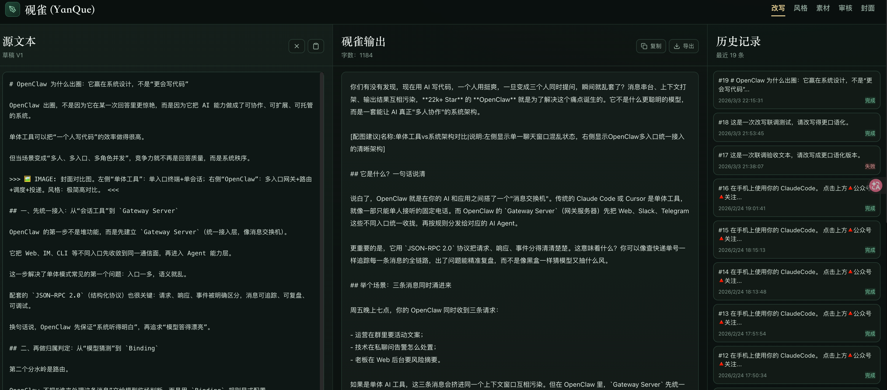
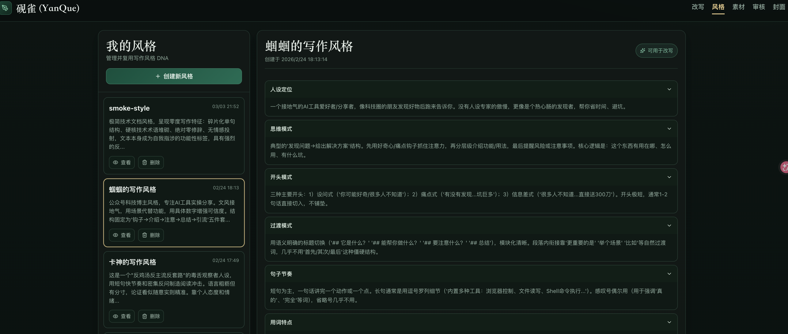
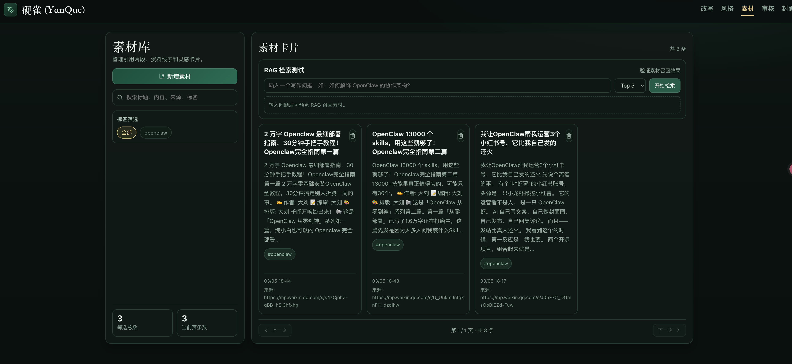
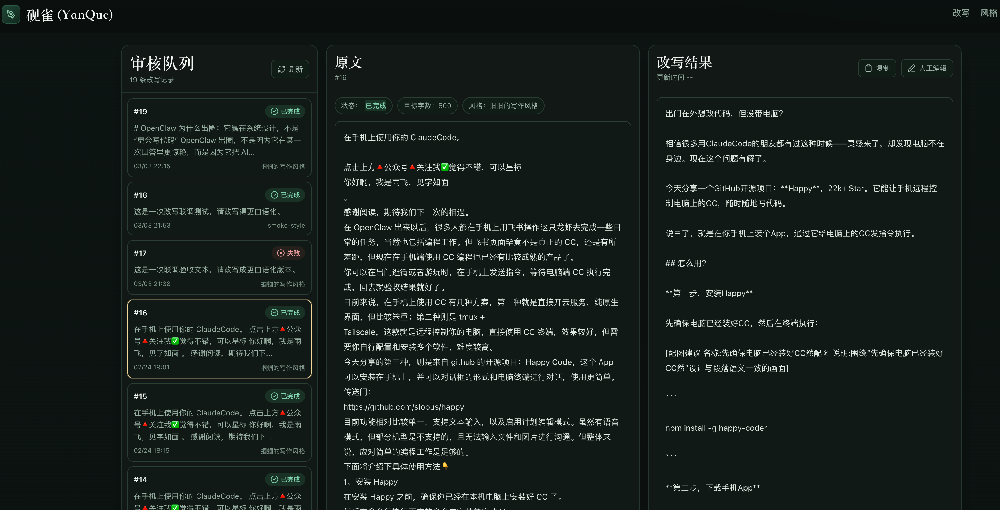
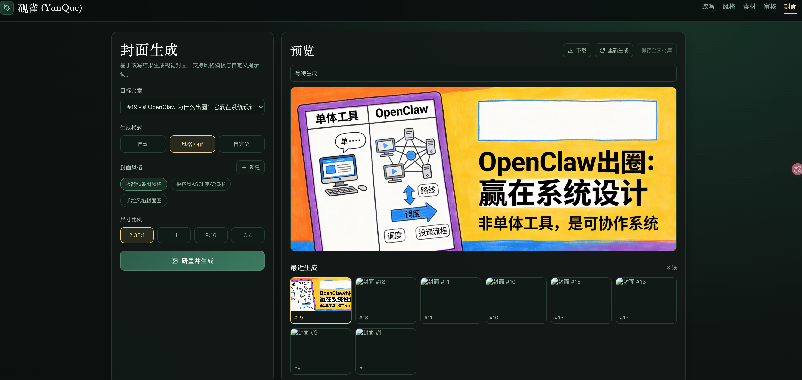

# Write Agent

A full-stack AI writing agent for style extraction, rewriting, review, and cover generation (FastAPI + React/Vite).

[中文文档](./README.zh-CN.md)

## Highlights and Business Value

- Productize fragmented writing actions into one standardized loop: material retrieval, style-constrained rewriting, quality review, human refinement, and cover generation.
- In our practical usage, value shows up in two dimensions: productivity (long-form output can move from hour-level effort to roughly tens-of-minutes), and quality (more stable style, reviewable outputs, and replayable process instead of one-shot prompt luck).
- During writing, the app can run RAG retrieval against your materials library and show cited materials in the output context for traceability.

## Core Workflow and Screenshots

1. **Rewrite**: input source text, pick style, stream output.



2. **Style Management**: create and reuse writing style DNA.



3. **Materials (RAG)**: collect materials, test retrieval, and reuse in writing.



4. **Review**: inspect rewrite results and do manual edits when needed.



5. **Cover Generation**: generate covers from rewrite results with multiple modes and ratios.



## Quick Start

### 1. Clone and install

```bash
git clone https://github.com/guoguo-tju/write_agent.git
cd write_agent
uv sync
cd frontend && npm install && cd ..
```

### 2. Configure API keys

```bash
cp .env.example .env
```

Edit `.env` with:

- Required: `OPENAI_API_KEY`, `VOLCENGINE_API_KEY`
- Optional: `SILICONFLOW_API_KEY` (for writing-time RAG embedding/retrieval and citation display)

### 3. Start backend

```bash
PYTHONPATH=src DATABASE_URL=sqlite:///./data/acceptance_write_agent.db .venv/bin/uvicorn write_agent.main:app --host 127.0.0.1 --port 8000
```

### 4. Start frontend

```bash
cd frontend
npm run dev
```

### 5. Open locally

- Frontend: `http://127.0.0.1:5173`
- Backend docs: `http://127.0.0.1:8000/docs`

Note: without `SILICONFLOW_API_KEY`, the main flow still runs, but writing-time RAG retrieval/citation is limited.

## Project Structure

```text
.
├── src/write_agent/        # backend (api, models, services)
├── frontend/               # React + Vite frontend
├── scripts/                # db/init/smoke scripts
├── tests/                  # backend tests
├── data/                   # sqlite + chroma data
└── docs/screenshots/       # README screenshots
```

## FAQ

### 1) Backend starts but rewrite/style/review fails

Check `OPENAI_API_KEY` and related OpenAI-compatible config in `.env`.

### 2) Cover generation fails

Check `VOLCENGINE_API_KEY`, `VOLCENGINE_BASE_URL`, and model config.

### 3) Materials retrieval is empty

Check `SILICONFLOW_API_KEY` and network access to embedding service.

### 4) Frontend cannot call backend (CORS or network)

Use `http://127.0.0.1:5173` for frontend and `http://127.0.0.1:8000` for backend, and keep `VITE_API_URL` aligned.

### 5) Why are cover images not in GitHub?

Cover images are runtime assets stored locally under `./data/covers`, and this directory is intentionally ignored by Git.

## License

MIT License.
